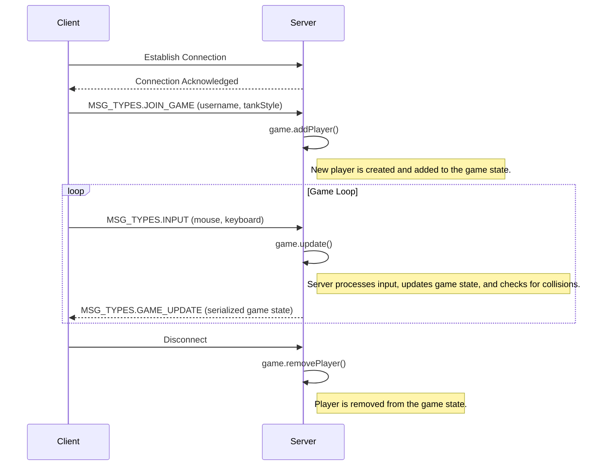
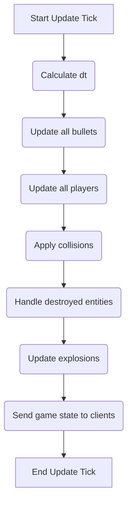

# DankTanks.io Design Document (Detailed)

## 1. Introduction

DankTanks.io is a fast-paced, real-time multiplayer 2D tank game. Players control tanks, battle against each other to score points, and compete for the top spot on a leaderboard. The game features power-ups, such as a rapid-fire crown, to enhance gameplay. This document provides a detailed overview of the system's architecture and implementation.

## 2. System Architecture

The game is built on a classic **client-server architecture**.

*   **Server:** An authoritative Node.js server that manages the entire game state, including player positions, game logic, and physics. It is responsible for all calculations to prevent cheating. By having the server be the single source of truth, clients cannot manipulate their local game state to gain an unfair advantage (e.g., by changing their health or position).
*   **Client:** A lightweight web-based client that renders the game state received from the server and captures user input. The client is essentially a "dumb" terminal that displays what the server tells it to.

Communication between the client and server is handled in real-time using **Socket.IO**, which enables low-latency, event-based communication over WebSockets. The server runs on Express.js, which also serves the static client files.

```mermaid
graph TD;
    subgraph Client (Browser);
        A[User Input];
        B[Client-Side Logic];
        C[Networking];
        D[Canvas Rendering];
    end;

    subgraph Server (Node.js);
        E[Networking];
        F[Game Logic];
        G[Physics & Collisions];
        H[Player & Entity Management];
    end;

    A --> B;
    B --> C;
    C --> D;

    E --> F;
    F --> G;
    F --> H;

    B -- Sends Input --> E;
    E -- Sends Game State --> B;
```

### 2.1. Client-Server Interaction Flow

1.  **Connection:** The client connects to the server.
2.  **Join Game:** The client sends a `JOIN_GAME` message with the player's chosen username and tank style.
3.  **Game State Updates:** The server adds the player to the game and starts sending `GAME_UPDATE` messages to the client at a high frequency. These updates contain the current state of all relevant game objects.
4.  **Input:** The client captures user input (keyboard and mouse) and sends it to the server in `INPUT` messages.
5.  **Game Logic:** The server processes the input, updates the game state, and broadcasts the changes to all clients.
6.  **Disconnection:** When a client disconnects, the server removes the player from the game.



## 3. Client-Side (`src/client`)

The client is responsible for rendering the game and capturing user input.

### 3.1. File Breakdown

*   `index.js`: The main entry point. Initializes the application.
*   `assets.js`: Manages the loading of game assets (images).
*   `input.js`: Captures keyboard and mouse input.
*   `leaderboard.js`: Renders the leaderboard.
*   `map.js`: Renders the mini-map.
*   `networking.js`: Handles communication with the server via Socket.IO.
*   `playMenu.js`: Manages the main menu UI.
*   `render.js`: Renders the main game canvas.
*   `state.js`: Manages the client-side game state.

### 3.2. Rendering (`render.js`)

The game is rendered on multiple HTML `<canvas>` elements to layer different visual components:
-   `game-canvas` & `game-canvas-2`: These are used for **double buffering** the main game scene. One canvas is hidden and used for drawing the next frame, then they are swapped. This prevents flickering. This canvas displays the players, bullets, explosions, and power-ups.
-   `map-canvas`: A separate canvas for rendering the mini-map, which shows the locations of all players.
-   The rendering is synchronized with the browser's refresh rate using `requestAnimationFrame` for efficiency.

### 3.3. State Management (`state.js`)

The client maintains a local copy of the game state, which is updated on every `GAME_UPDATE` message from the server. This state includes the position and orientation of the local player and all other nearby objects. The client performs interpolation between server updates to create the illusion of smooth movement, even if network packets are delayed.

## 4. Server-Side (`src/server`)

The server is authoritative and controls all aspects of the game logic.

### 4.1. File Breakdown

*   `server.js`: The main server entry point. Sets up Express and Socket.IO.
*   `game.js`: The core game logic, containing the game loop and state management.
*   `player.js`, `bullet.js`, `obstacle.js`, etc.: Classes representing the different game entities.
*   `collisions.js`: Handles collision detection logic.
*   `leaderboard.js`: Manages the leaderboard data.
*   `utils/sat.js`: An implementation of the Separating Axis Theorem for collision.

### 4.2. Core Game Logic (`game.js`)

The `Game` class orchestrates the entire game.
-   **Game Loop:** The `update()` method is called at a fixed rate of 60 FPS. The order of operations in each tick is critical:



### 4.3. Collision Detection (`collisions.js`)

-   Collision detection is performed between:
    -   Players and bullets
    -   Players and obstacles
    -   Bullets and obstacles
    -   Players and crown power-ups
-   It uses the **Separating Axis Theorem (SAT)**, implemented in `sat.js`. SAT is a technique for determining if two convex polygons are intersecting. This is more accurate than simple bounding box collision for the shape of the tanks.

### 4.4. Networking and Data Structures

-   **Data Structures:**
    -   `sockets`: An object mapping `socket.id` to the `socket` object for quick lookups.
    -   `players`: An object mapping `socket.id` to the `Player` object.
    -   `bullets`, `obstacles`, `crowns`, `explosions`: Arrays to hold these game entities.
-   **Socket.IO Messages (`shared/constants.js`):**
    -   `MSG_TYPES.JOIN_GAME`: Client sends to join the game.
    -   `MSG_TYPES.GAME_UPDATE`: Server sends to clients with the latest game state.
    -   `MSG_TYPES.INPUT.*`: Client sends to server with user input.
    -   `MSG_TYPES.GAME_OVER`: Server sends to a client when their player has been destroyed.

## 5. Shared Code (`src/shared`)

The `src/shared` directory is crucial for code that needs to be accessed by both the client and the server.
-   **`constants.js`:** This file defines a wide range of game parameters, ensuring consistency. Examples include:
    -   `MAP_SIZE`: Dimensions of the game world.
    -   `PLAYER_MAX_HP`: Maximum health of a player.
    -   `BULLET_DAMAGE`: Damage dealt by a single bullet.
    -   `MSG_TYPES`: An object containing the names of all Socket.IO messages, preventing typos.

## 6. Build Process

The project uses Webpack to bundle and build the client-side assets.
-   **`webpack.common.js`:** Contains the base Webpack configuration.
-   **`webpack.dev.js`:** Merges with the common config for development builds.
-   **`webpack.prod.js`:** Merges with the common config for production builds, adding optimizations like minification.
-   **Babel:** Used to transpile modern JavaScript (ES6+) for browser compatibility.
